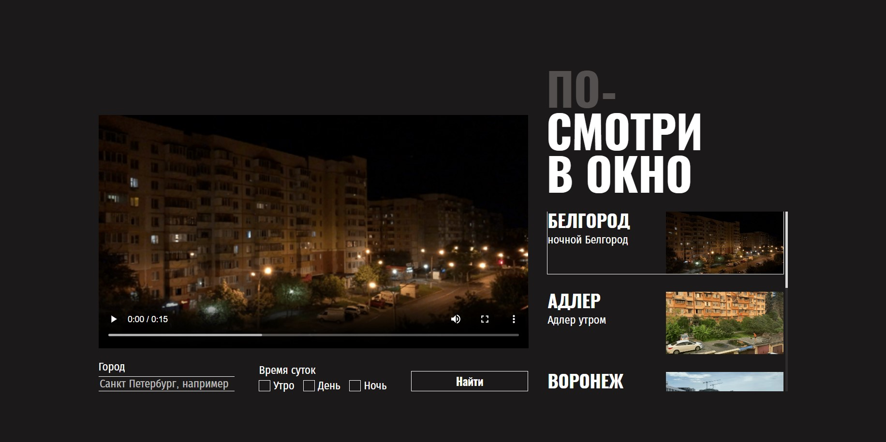

# По-смотри в окно

Проект «По-смотри в окно» — интерфейс для просмотра видео с фильтрацией по городу и времени суток.  

## Технологии

- HTML5
- CSS3 (Flexbox, кастомные чекбоксы, псевдоэлементы)
- JavaScript 

## Использование

Введите город в поле поиска.

Выберите время суток с помощью чекбоксов.

Нажмите «Найти» для фильтрации видео.

Просмотр доступен прямо на странице без перезагрузки.

### Скриншот

### Ссылки

- Задание: [Figma](https://www.figma.com/design/vCfXwrcREKdx7cs4aJuHPg/FD%3A-2-спринт.-Проектная-работа?node-id=0-1&p=f)
- Решения: [Github](https://github.com/Yarlolo/posmotri-v-okno-ad)

## Автор

- Github - [Yarlolo](https://github.com/Yarlolo)
